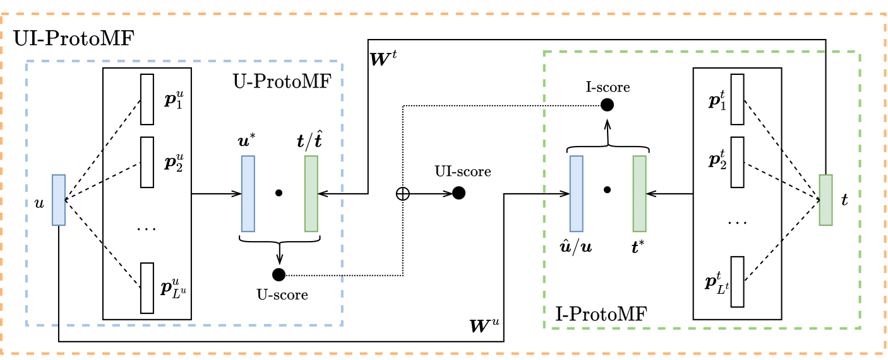

# ProtoMF: Prototype-based Matrix Factorization for Effective and Explainable Recommendations

This repository hosts the code and the additional materials for the paper "ProtoMF: Prototype-based Matrix Factorization
for Effective and Explainable Recommendations" by [Alessandro B. Melchiorre](https://karapostk.github.io/), Navid
Rekabsaz, Christian Ganhör, and Markus Schedl at RecSys 2022.



```latex
@inproceedings{melchiorre2022protomf,
    title = {ProtoMF: Prototype-based Matrix Factorization for Effective and Explainable Recommendations},
    author = {Melchiorre, Alessandro B. and Rekabsaz, Navid and Ganhör, Christian and Schedl, Markus},
    booktitle = {Sixteenth ACM Conference on Recommender Systems},
    year = {2022},
    publisher = {Association for Computing Machinery},
    address = {New York, NY, USA},
    series = {RecSys '22},
    doi = {10.1145/3523227.3546756},
    isbn = {978-1-4503-9278-5/22/09}
}
```

## Repository Structure

The code is written in Python and relies on [Pytorch](https://pytorch.org/) to compute the model's gradients. We further
use [ray tune](https://www.ray.io/ray-tune) for hyperparameter optimization and [weight and biases](https://wandb.ai/)
for logging, among many cool packages.

**Code** is structured in the following way and briefly described below:

```bash
.
├── confs
│   └── hyper_params.py
├── data
│   ├── amazon2014
│   │   └── amazon2014_splitter.py
│   ├── lfm2b-1mon
│   │   └── lfm2b-2020_splitter.py
│   ├── ml-1m
│   │   └── movielens_splitter.py
│   └── README.md
├── experiment_helper.py
├── feature_extraction
│   ├── feature_extractor_factories.py
│   └── feature_extractors.py
├── pdfs and images
│   ├── protomf_appendix.pdf
│   ├── protomf_diagram.png
│   └── ProtoMF__Prototype_based_Matrix_Factorization.pdf
├── protomf.yml
├── README.md
├── rec_sys
│   ├── protomf_dataset.py
│   ├── rec_sys.py
│   ├── tester.py
│   └── trainer.py
├── start.py
└── utilities
    ├── consts.py
    ├── eval.py
    └── utils.py
```

where the files/directories contain:

- `protomf.yml`: environment (install with `conda env create -f protomf.yml`)
- `start.py`: starting point to run the experiments (check with `python start.py --help`)
- `experiment_helper.py`: hyperparameter optimization procedure
- `confs/hyper_params.py`: hyperparameters of all the models
- `data/*`: data folder and data splitting procedure
- `feature_extraction/*`: code of the models
- `rec_sys/protomf_dataset.py`: general code for handling the dataset (including negative sampling)
- `rec_sys/rec_sys.py`: a general recommender system, used as base for all models
- `rec_sys/tester.py` and `rec_sys/trainer.py`: testing and training procedure respectively
- `utilities/*`: constants, evaluation metrics code, generic code

## Installation and configuration

### Environment

- Install the environment with
  `conda env create -f protomf.yml`
- Activate the environment with `conda activate protomf`

### Data

Follow the instructions to download all three datasets in `./data/README.md`. Place the datasets files in the right
folders and use the respective splitter.py files to pre-process the datasets.
To pre-process the data, generally you just need to

- move into the folder with `cd <dataset_folder>`
- run `python <dataset_name>_splitter.py -lh <folder_where_the_data_is>` (usually the data is already in the folder
  so `./` will suffice). Leave the saving path to `./`.

After the scripts finish running you will have 5 files:

- 3 files with the listening_history of the users for train, val, and test
- 2 files containing the user and item ids (as index in the rating matrix)

### Configuration

In `utilities/consts.py` you need to set:

- `DATA_PATH`: absolute path to the `./data` folder
- `WANDB_API_KEY`: API key of Weight and Biases, currently the results are only printed there.

## Run

The experiments can be started with

`python start.py -m <model> -d <dataset>`

For checking the options for model and dataset, use

`python start.py --help`

By default, `python start.py` runs the hyperparameter optimization for a single seed (check `utilities/consts.py`).
If the flag `-mp` is provided together with the model and dataset, then the script will run all three hyperparameter
optimization procedures and average the test results.

Results and progress can be checked on the Weight&Biases webpage.

## License 
The code in this repository is licensed under the Apache 2.0 License. For details, please see the LICENSE file.
## Acknowledgments

This work received financial support by the Austrian Science Fund (FWF): P33526 and DFH-23; and by the State of Upper Austria and the Federal Ministry of Education, Science, and Research, through grant LIT-2020-9-SEE-113 and LIT-2021-YOU-215.